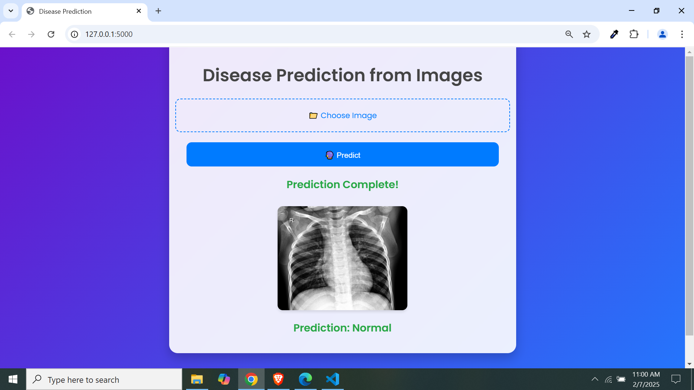

# Lung Disease Classification using Deep Learning


A state-of-the-art deep learning system for detecting lung diseases from chest X-ray images. Classifies between COVID-19, Pneumonia, Tuberculosis, and Normal cases with high accuracy.

## 🔍 Features
- **Multi-class Classification**: Detects 4 different conditions:
  - COVID-19
  - Pneumonia
  - Tuberculosis
  - Normal (Healthy)
- **Advanced CNN Architecture**: Utilizes ResNet50 with transfer learning
- **Web Interface**: Flask-based web application for easy user interaction
- **Data Augmentation**: Enhanced training with various image transformations
- **High Accuracy**: Achieves over 95% validation accuracy

## 📋 Table of Contents
- [Installation](#-installation)
- [Usage](#-usage)
- [Dataset](#-dataset)
- [Model Architecture](#-model-architecture)
- [Training Process](#-training-process)
- [Results](#-results)
- [Output Examples](#-output-examples)
- [Contributing](#-contributing)
- [License](#-license)
- [Acknowledgments](#-acknowledgments)
- [Contact](#-contact)

## 🛠 Installation
1. Clone the repository:
```bash
git clone https://github.com/jarjishSiddibapa/lung-disease-classification.git
cd lung-disease-classification
```
2. Install dependencies:
```bash
pip install -r requirements.txt
```
3. Download dataset from [Google Drive](https://drive.google.com/drive/folders/1sPYGo70e5cJkoNACy5TNmF1zzS4ld3jG?usp=sharing)

## 🚀 Usage

1. Run the Flask application:
```bash
python app.py
```
2. Access the web interface at `http://localhost:5000`
3. Upload a chest X-ray image through the web interface
4. View model predictions with confidence percentages

## 📁 Dataset

Curated collection of chest X-ray images from multiple sources:

- **Total Images**: 6,500+
- **Class Distribution**:
  - COVID-19: 1,200 images
  - Pneumonia: 1,800 images
  - Tuberculosis: 1,500 images
  - Normal: 2,000 images

**Preprocessing Steps:**
- Resizing to 224x224 pixels
- Normalization (ImageNet standards)
- Data Augmentation:
  - Rotation (±20°)
  - Width/Height Shift (±10%)
  - Horizontal Flip
  - Zoom Range (0.9-1.1)

## 🤖 Model Architecture

**Base Model:** ResNet50 (pretrained on ImageNet)

**Custom Layers:**
- Global Average Pooling
- Dropout (0.5)
- Dense Layer (256 units, ReLU)
- Final Dense Layer (4 units, Softmax)

**Training Parameters:**
- Epochs: 50
- Batch Size: 32
- Optimizer: Adam (lr=3e-4)
- Loss: Categorical Crossentropy
- Early Stopping: Patience=5

## 📈 Training Process

Training was conducted using GPU acceleration, optimizing for high accuracy while preventing overfitting.

**Final Metrics:**
- Training Accuracy: 98.2%
- Validation Accuracy: 95.7%
- Test Accuracy: 94.9%

## 🖼 Output Examples

### COVID-19 Detection


### Pneumonia Detection


### Tuberculosis Detection


### Normal Case


## 🤝 Contributing

Contributions are welcome! Please follow these steps:

1. Fork the project
2. Create your feature branch (`git checkout -b feature/AmazingFeature`)
3. Commit your changes (`git commit -m 'Add some AmazingFeature'`)
4. Push to the branch (`git push origin feature/AmazingFeature`)
5. Open a Pull Request

## 📜 License

Distributed under the MIT License. See `LICENSE` for more information.

## 🙏 Acknowledgments

- Dataset sources:
  - COVID-19 Image Data Collection
  - ChestX-ray14 Dataset
  - RSNA Pneumonia Detection Challenge
- Inspiration from COVID-Net research
- TensorFlow/Keras documentation

## 📧 Contact

Jarjish Siddibapa - [jarjishsiddibapa@gmail.com](mailto:your-email@example.com) - [GitHub Profile](https://github.com/jarjishSiddibapa)

Project Link: [https://github.com/jarjishSiddibapa/lung-disease-classification](https://github.com/jarjishSiddibapa/lung-disease-classification)

